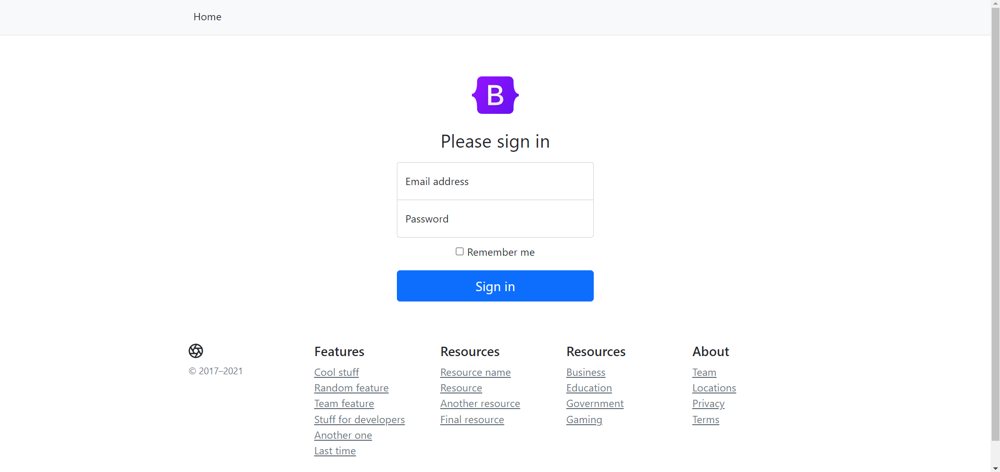
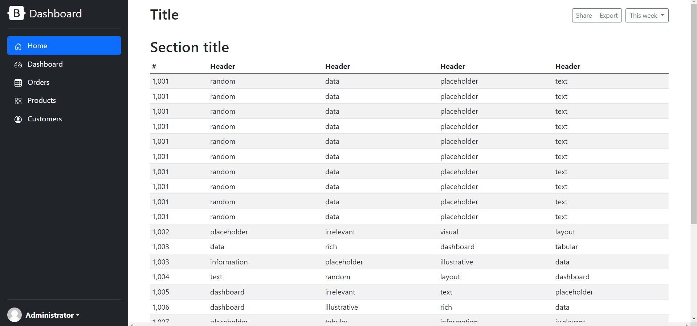

## MevnPractice

This repo contains MEVN Stack practice with [bootstrap examples](https://getbootstrap.com/docs/5.1/examples/) and a simple expressjs api

## Frontend

### Setup

- Open terminal in frontend folder
- Run `npm install` to install dependences
- Run `npm run serve` to run vuejs app

### Views

- Landing page

- Sign in

- Sign up

- Dashboard

- Pricing

- Features

## LICENCE

MIT Licence  
Check the LICENCE file
