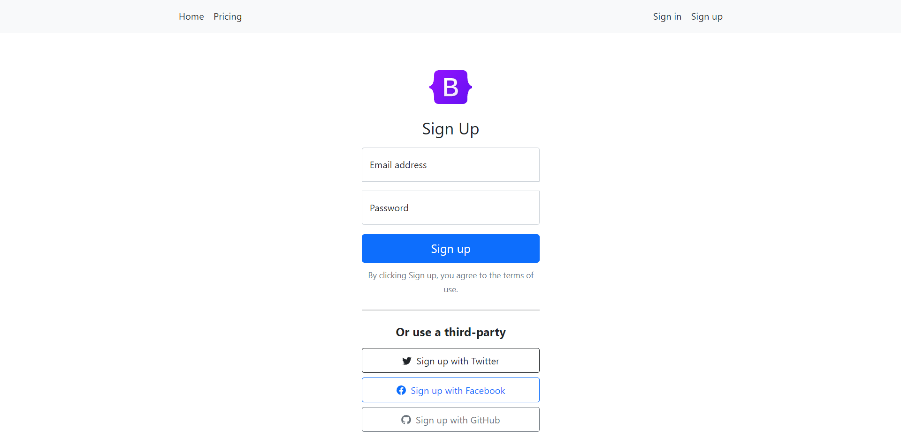
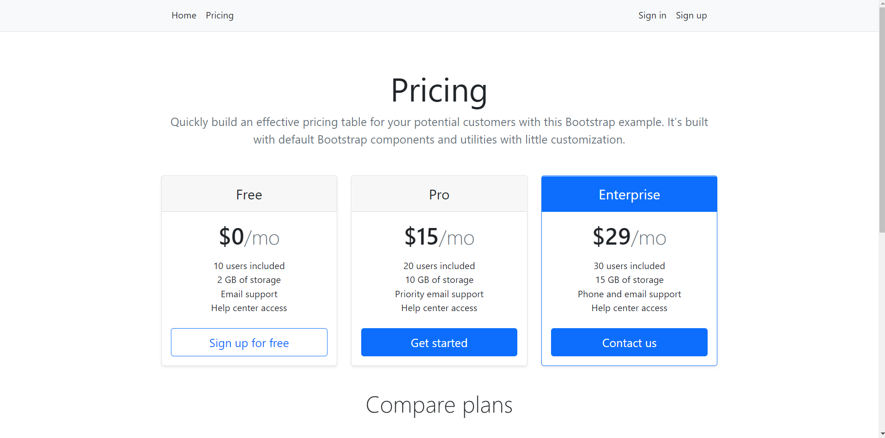
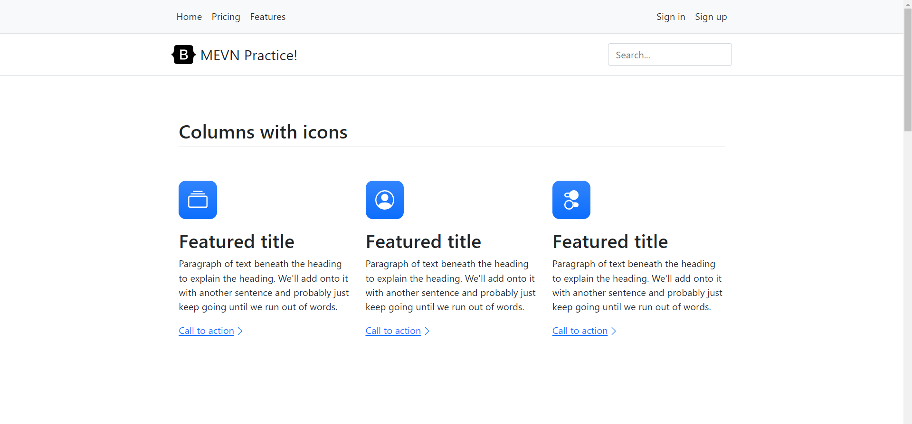
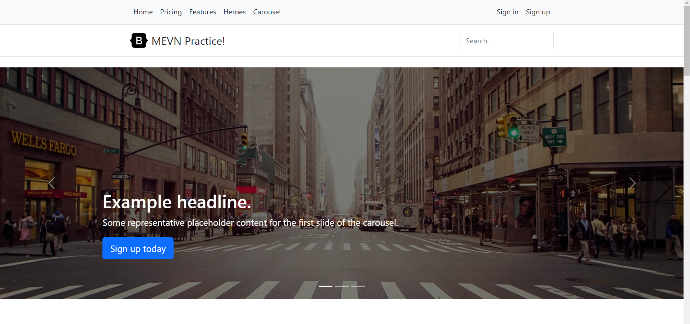

## MevnPractice

This repo contains MEVN Stack practice with [bootstrap examples](https://getbootstrap.com/docs/5.1/examples/) and a simple expressjs api

## Backend
you can check the express api also in [backend branch](https://github.com/Arkaikus/MevnPractice/tree/backend)

### Setup

- Go to `backend` folder
- Run `npm i` to install dependences
- Run `npm run dev` to launch nodemon dev server
- Go to `localhost:4000`
- Check the thunderclient collection

### Docs

- Posts
  - **controller.js**: methods for get,update,delete posts
  - **model.js**: mongoose model
  - **routes.js**: app setup with posts routes

- Customers
  - **controller.js**: methods for get,update,delete customers
  - **model.js**: mongoose model
  - **routes.js**: app setup with customers routes

- Products
  - **controller.js**: methods for get,update,delete products
  - **model.js**: mongoose model
  - **routes.js**: app setup with products routes

## Frontend

you can check the vuejs app also in [frontend branch](https://github.com/Arkaikus/MevnPractice/tree/frontend)

### Setup

- Open terminal in frontend folder
- Run `npm install` to install dependences
- Run `npm run serve` to run vuejs app

### Views

- Landing page

- Sign in

- Sign up

- Dashboard

- Pricing

- Features

- Heroes

- Carousel

## LICENCE

MIT Licence  
Check the LICENCE file
